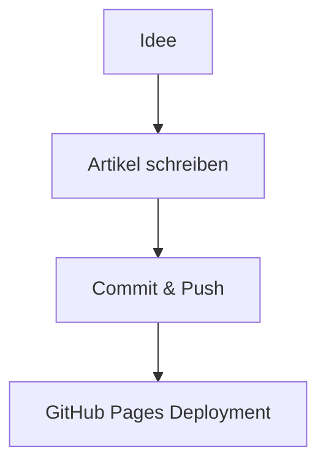

Dies ist der erste Eintrag. Dieses Blog unterstützt **Syntax Highlighting** und **Mermaid-Diagramme**.

## Beispiel: Code

```python
def fibonacci(n: int) -> list[int]:
    values = [0, 1]
    for _ in range(2, n):
        values.append(values[-1] + values[-2])
    return values[:n]

print(fibonacci(8))
```

## Beispiel: Mermaid


