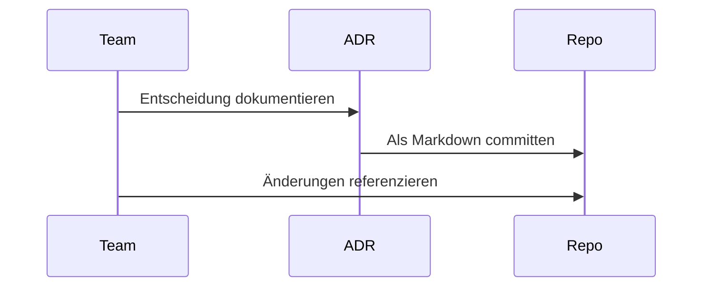

ADRs (Architecture Decision Records) helfen dabei, Entscheidungen langfristig nachvollziehbar zu dokumentieren.

## Mini-Ablauf

Wenn später Diskussionen entstehen, ist der Kontext direkt im Repository auffindbar.
